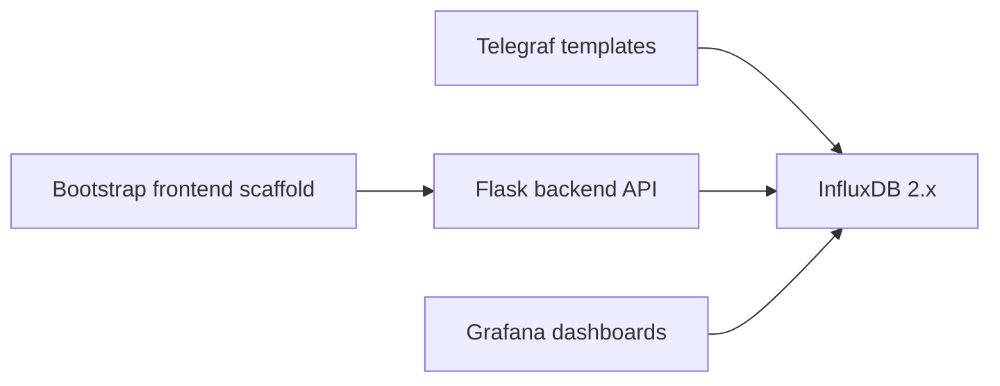

# FEMS Next Architecture

## Scope

This document describes the initial scaffold for the new FEMS development project in `D:\fems-next`.
The existing operating project in `D:\FEMS` is read-only reference material and must not be modified by this project.

## Components

## Data Flow

1. Future equipment collectors will write power data to InfluxDB measurement `gems_power`.
2. Operators can enter production quantities through the backend API into `production_input`.
3. Operators can register maintenance history through the backend API into `maintenance_log`.
4. The backend calculates electric intensity by combining energy usage and production quantity.
5. Grafana reads InfluxDB data and displays trends, calculated intensity, and target intensity lines.

## InfluxDB Schema

Bucket: `gems_test`

Measurement: `gems_power`

Tags:

- `factory`
- `process`
- `meter`
- `feeder`
- `furnace`

Fields:

- `avg_v`
- `avg_a`
- `power_w`
- `avg_pf`
- `sum_kwh`

Additional measurements:

- `production_input`: production quantity entered by operators.
- `maintenance_log`: maintenance history entered by operators.

## Backend Responsibilities

- Provide health and configuration endpoints.
- Accept direct production input.
- Accept Excel production upload metadata and future parsed rows.
- Calculate electric intensity from `sum_kwh` and production quantity.
- Store and retrieve maintenance log entries.
- Keep equipment collection logic outside the scaffold until the collection design is finalized.

## Frontend Responsibilities

- Provide Bootstrap-based screens for:
  - Dashboard overview
  - Production direct input
  - Excel upload
  - Electric intensity view
  - Settings
  - Maintenance history

## Grafana Responsibilities

- Provision the InfluxDB datasource.
- Reserve dashboard provisioning folders for future dashboard JSON files.
- Show target electric intensity lines once panels are implemented.

## Telegraf Responsibilities

- Hold configuration templates for future GEMS3500 or related power meter collection.
- Avoid real device communication in the scaffold stage.
